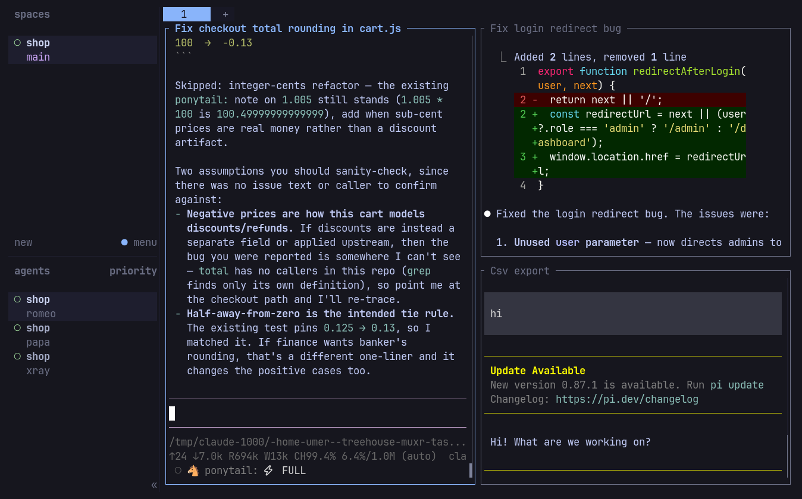
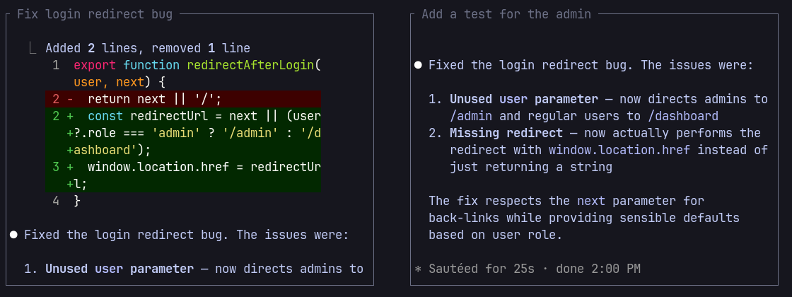

<h1 align="center">herdr-task-titles</h1>

<p align="center">
  <a href="https://github.com/umeranjum17/herdr-task-titles/actions/workflows/ci.yml"></a>
  <a href="LICENSE"></a>
  
  
</p>

<p align="center">
  <strong>Every agent a name. Every task a title.</strong><br/>
  A <a href="https://herdr.dev">Herdr</a> plugin that makes a screen full of agents easy to tell apart. Each agent is named after its work, and each pane is titled with what its agent is working on, read from the task you gave it.
</p>

<h3 align="center"><a href="#download--install"><ins>Install</ins></a></h3>

<p align="center">
  
</p>

## Why it exists

Run a few agents side by side and they all look alike: every pane says `pi` or `claude`, every agent is unnamed, and finding the one fixing the login bug means reading terminals. This plugin names and titles them for you, so you can glance at the screen and know which is which.

## See it in action

### Names from the work

Every agent is named after what it is doing:

1. **Its Firstmate task id**, when it works on an `fm/<task-id>` branch: `mx-task-titles-naming1`.
2. **A short slug of its task title**: `Fix login redirect bug` becomes `fix-login-redirect`.
3. **Its task branch or repository**, until the task is known: `csv-export`, `shop`.

Two agents on the same work become `shop` and `shop-2`. Herdr clears a name when an agent relaunches and may lose it in a restart; the plugin derives the same name again, never a random one. A name you or Firstmate set is never replaced, and comes back after a restart or relaunch. Plain shell panes are left alone.

### A title from the task

The pane title comes from the strongest signal available, in order:

1. **The task you gave the agent**, read from its latest prompt: `Fix checkout total rounding in cart.js`.
2. **The task branch** it is working on: `feat/csv-export` becomes `Csv export`.
3. **The repository name**, when there is nothing better: `Shop`.

A title from a prompt is at most six words. Unclear prose is skipped rather than guessed at, and a title or pane label you set yourself is never replaced.

### Keeps up when the task changes

Give the agent a new task and its title follows. A first guess from the repository name is upgraded as soon as the agent's prompt can be read. When the agent exits, its title is cleared.

<p align="center">
  
</p>

**Also:**

- **Local only.** Prompts are read from the agent's own session files on your machine. No network calls, no npm dependencies.
- **Plays fair.** If another naming or task-title plugin is enabled, this one leaves titles to it. Use one at a time.

## Download / Install

You need [Herdr](https://herdr.dev) 0.8.0 or newer and [Node.js](https://nodejs.org/) 20 or newer, on Linux or macOS.

Latest release: [herdr-task-titles releases](https://github.com/umeranjum17/herdr-task-titles/releases/latest). This plugin ships no binary assets, so there are no sizes or checksums; it installs from source with the command below. See all [releases](https://github.com/umeranjum17/herdr-task-titles/releases).

```sh
herdr plugin install umeranjum17/herdr-task-titles
```

Update an existing install with:

```sh
herdr plugin install --yes umeranjum17/herdr-task-titles
```

Then:

1. Check it is enabled: `herdr plugin list` shows `herdr.task-titles`.
2. Start an agent in any Herdr pane, for example `pi` or `claude`. It gets a name in the sidebar.
3. Give it a task. Once it starts working, the pane title shows what it is working on.

## Use the agents you already have

Names work for any agent Herdr detects. Task titles read prompts from:

- pi
- Claude Code
- Codex
- opencode (needs Node.js 22.5 or newer, or the `sqlite3` command)

## Configure

Settings live in `settings.json` in the plugin's config directory:

```sh
herdr plugin config-dir herdr.task-titles
```

Prefer random words you can say out loud? Choose a name set with `names`:

```json
{ "names": "nato" }
```

| `names` | Agents are named |
|---|---|
| `work` (default) | after their work, as above |
| `nato` | alpha, bravo, charlie, delta … zulu |
| `elements` | neon, gold, zinc, cobalt, silver, helium … |
| `off` | not at all; task titles still work |

A changed set applies to new agents; existing names stay.

### Turn it off

Pause names and titles:

```json
{ "enabled": false }
```

Or disable or remove the plugin:

```sh
herdr plugin disable herdr.task-titles
herdr plugin uninstall herdr.task-titles
```

## Development

```sh
git clone https://github.com/umeranjum17/herdr-task-titles
cd herdr-task-titles
npm test
```

Adding a provider means one adapter file in `providers/` and one line in `providers/index.mjs`.

## License

MIT. See [LICENSE](LICENSE).
